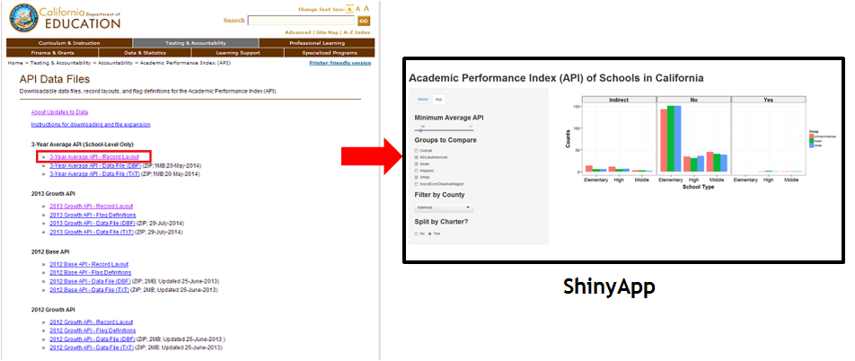
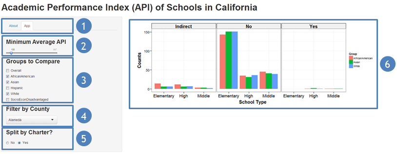

---

title: {SHINY APP: ACADEMIC PERFORMANCE INDEX FOR CALIFORNIA SCHOOLS FROM 2011-2013}
subtitle: DEVELOPING DATA PRODUCTS *FINAL COURSE PROJECT*
widgets: [] # {mathjax, quiz, bootstrap}
url: {lib: libraries}
mode: selfcontained
framework : revealjs
highlighter : highlight.js 
hitheme: tomorrow

--- 

## SHINY APP: ACADEMIC PERFORMANCE INDEX FOR CALIFORNIA SCHOOLS FROM 2011-2013

http://pacificprince.shinyapps.io/Shiny/

Final course project for *Developing Data Products* Coursera class

---

## WHY DO WE NEED THIS APP?
- The [California Department of Education](http://www.cde.ca.gov/ta/ac/) is an agency 
within the Government of California that oversees public education. The department oversees funding and testing, and holds local educational agencies accountable for student achievement.

- In accordance with the *California's Public Schools Accountability Act of 1999*,
the department collects information on a variety of academic measures, one of which is
the **Academic Performance Index (API)**.

- This data is made available freely to the public but is in a table format. This makes it challenging for an analyst to explore and investigate. This is where the ShinyApp comes in!

--- 

## WHAT IS THE SCOPE OF THIS APP?

- The dataset used in the Shiny application is the API for public schools in California compiled from 
2011 - 2013 and can be found at their [website](http://www.cde.ca.gov/ta/ac/ap/apidatafiles.asp). 
- Information is presentated as a bar plot that allows the data analyst to quickly view and easily compare the three year weighted average API by group, county and charter funding.


- App on Github: https://github.com/pacificprince/DevDataProdProjShiny

--- 

## HOW TO USE IT?
1. There are two tabs,
  - **About**: A quick overview of how to use the application. 
  - **App**: Click on this tab for the ShinyApp shown below!
1. Select the minimum average API using the slider.
2. Add or remove groups to compare. 
3. Filter by county from the drop down list.
4. Choose whether to split schools by charter funding.
5. A bar plot comparing the API will appear on the right.


--- 

## SAMPLE OUTPUT FROM APP (R CODE)
```{r initialize, echo=FALSE, results="hide", cache=TRUE}
library(ggplot2)
library(grid)

source("src/ggtheme_pub.R")
```

```{r plot_sample, fig.width=12, fig.height=4.5, fig.align='center', cache=TRUE}
data <- readRDS("data/3_year_avg_api.rds")

data <- subset(data, AvgAPI > 0)  
data <- subset(data, CountyName == "Alameda")
data <- data[data$Group %in% c("AfricanAmerican", "Asian", "White"), ]

p <- ggplot(data, aes(SchoolType, fill = Group)) + theme_pub()
p <- p + geom_bar(position="dodge") + xlab("School Type") + ylab("Counts")
p <- p + facet_grid(. ~ Charter)

print(p)
```


