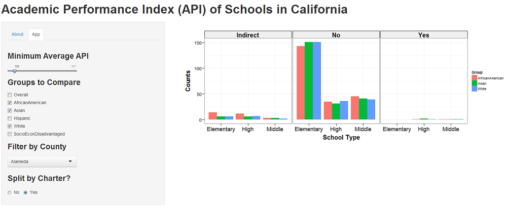

--- 
title: Developing Data Products
subtitle: Course Project
author: Prashanth Kumar
job: Engineer, Semiconductor Research
logo: logo_ddp.jpg
license: by-nc-sa
widgets: [] # {mathjax, quiz, bootstrap}
github: {user: pacificprince, repo: DevDataProducts}
url: {lib: libraries}
mode: selfcontained
framework : io2012
highlighter : highlight.js 
hitheme: tomorrow
ext_widgets: {rCharts: [libraries/nvd3]}

--- bg:lightgoldenrodyellow

## Summary
### Goal
The goal of this project was to write an Shiny application that demonstrate's 
some of Shiny's features. Calculations from operations on `ui.R` are displayed
as reactive output on `server.R`.
### Dataset
- "The cornerstone of California's Public Schools Accountability Act of 1999; measures the academic performance and growth of schools on a variety of academic measures" ([site](http://www.cde.ca.gov/ta/ac/)), one of 
which is the *Academic Performance Index (API)*. 
- The dataset used in the Shiny application is the API for public schools in California compiled from 
2011 - 2013 and can be found [here](http://www.cde.ca.gov/ta/ac/ap/apidatafiles.asp). 
The corresponding codebook for this datasoure is [here](http://www.cde.ca.gov/ta/ac/ap/reclayoutApiAvg.asp). 
The distribution of three year weighted average APIs across various counties in 
California is shown on the next slide.
- Of particular focus in the UI is the breakdown of the three year
weighted API average by race, county and charter funded schools.

--- bg:lightgoldenrodyellow
## Three Year Average API across California Counties 


```r
library(ggplot2)
library(grid)
source("src/ggtheme_pub.R")
map <- ggplot(data_map, aes(x=long, y=lat)) + theme_pub()
map <- map + geom_polygon(aes(group=group, fill=avg_api), 
                          color="black", size=0.75)
map <- map + coord_map("polyconic") + facet_grid(. ~ school_type)
map <- map + theme(axis.text.x=element_text(size = 14, vjust = 0), 
                   axis.text.y=element_text(size = 14, hjust = 1))
map <- map + xlab("Longitude") + ylab("Latitude")
map <- map + scale_fill_gradient(low='#EEEEEE', high='darkgreen')
print(map)
```

 


--- bg:lightgoldenrodyellow

## ShinyApp
Shown below is the widget interace of the Shiny application.
<br>



--- bg:lightgoldenrodyellow

## Github repos / gh-pages:
- ShinyApp: http://pacificprince.shinyapps.io/Shiny/
- Slidify: 
  - Github: https://github.com/pacificprince/DevDataProdProj
  - gh-page: http://pacificprince.github.io/DevDataProdProj/presentation.html


